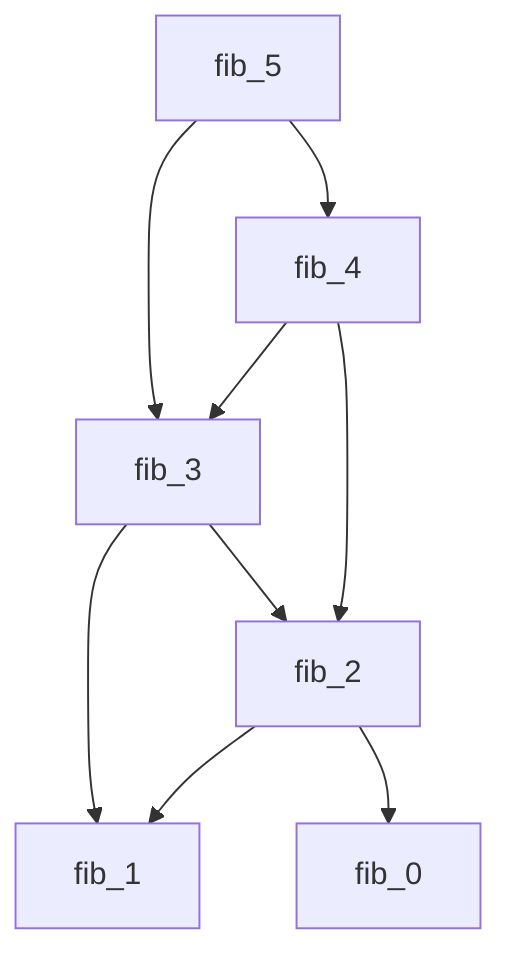
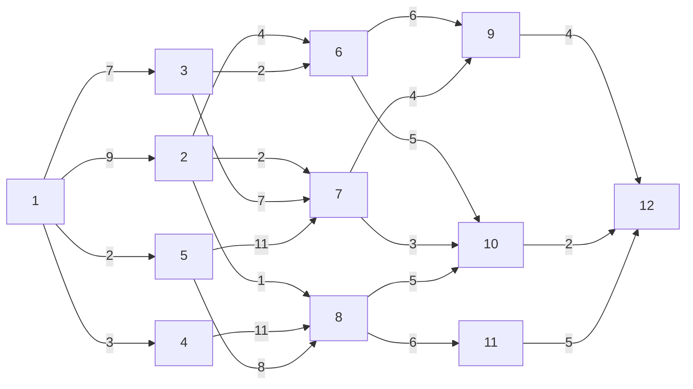

# Content
1. [Dynamic programming Introduction](#dynamic-programming)
2. [DP1: Fibonacci sequence](#dp1-fibonacci-sequence)
---
# Dynamic programming
- Greedy and Dynamic are used for the optimization problems 

- Dynamic prog: We find out all the solutions and then choose the best solution
    - More time consuming compared to greedy
    - Uses recursion and iteration
    - Solves problem in two approach 
        - Tabulation
        - Memoization

- Principal of optimality 
    Sequence of descision to find the best solution
---
# DP1: Fibonacci sequence 

### Recursive approach
```c
int fib(int n){
    if(n <= 1)
        return n;
    return fib(n-1) + fib(n-2);
}
```

Trace (Ex: fib(5))


```
T(n) = 2T(n-1) + 1
O(2^n)
```

### Memoization of fib seq
Top down approach
```java
//fib(5)

int[] element_cache = new int[element];
Array.fill(element_cache, -1);

int fib(int n){
    if (n <= 1)
        return n;

    if (element_cache[n] != -1)
        return element_cache[n];
    
    int fib_n_1 = -1
    if (element_cache[n-1] != -1)
        fib_n_1 = element_cache[n-1];
    else
        fib_n_1 = fib(n-1);
        element_cache[n-1] = fib_n_1;

    int fib_n_2 = -1
    if (element_cache[n-2] != -1)
        fib_n_2 = element_cache[n-2];
    else
        fib_n_2 = fib(n-2);
        element_cache[n-2] = fib_n_2;

    return fib_n_1 + fib_n_2;
}
```

### Tabulation method for fib seq
Bottom up approach
```java

int fib(int n){
    int[] F = new int[n];
    if (n <= 1)
        return n;
    
    for (int i = 2; i <= n; i++){
        F[i] = F[i-2] + F[i-1];
    }
    return F[n];
}
```

--- 
# DP2: Multistage graph
- A direct weighted graph where vertices are divided into stages where vertices are connected from one stage to another 
- First stage and the last stage has only one vertex to represent the `source` and the `sink`
- Useful in allocating the resource allocation
- __Objective of the problem:__ To select the minimum cost of travel from source to the sink node [Minimization, Optimization problem]



## Solving the problem
- Starting at the sink calculate the cost from that node to sink
> cost(12) = 0; D = 12 
> Here D denotes the distination taken

- Now going to all other vertices connected to the visited vertex 
> cost(9 to 12) = 4 + cost(12) = 4 ; D = 12
> cost(10 to 12) = 2 + cost(12) = 2; D = 12
> cost(11 to 12) = 5 + cost(12) = 5; D = 12

- Now considering 6 (Final cost(6 to 12) = 7)
> cost(6 to 12) = min(cost(6 to 9 and 9 to 12), cost(6 to 10 and 10 to 12))
> = min(6+4, 5+2) = 7; D = 10

- Now considering 7 (Final cost(7 to 12) = 5)
> cost(7 to 12) = min(cost(7 to 9 and 9 to 12), cost(7 to 10 and 10 to 12))
> = min(4+4, 3+2) = 5; D = 10

- Now considering 8 (Final cost(8 to 12) = 7)
> min(cost(8 to 10 and 10 to 12), cost(8 to 11 and 11 to 12))
> min(5+2, 6+5) = 7; D = 10

- Now considering 2 (Final cost(2 to 12) = 7)
```
= min(
    cost(2 to 6 and 6 to 12),
    cost(2 to 7 and 7 to 12),
    cost(2 to 8 and 8 to 12)
)

= min(4+7, 2+5, 1+7) = 7; D = 7
```

- Now considering 3 
```
= min(
    cost(3 to 6 and 6 to 12),
    cost(3 to 7 and 7 to 12)
)

= min(2+7, 7+7) = 9; D = 6
```

- Now considering 4
```
= min(
    cost(4 to 8 and 8 to 12)
)
= min(11 + 7) = 18; D = 8
```

- Now considering 5
```
= min(
    cost(5 to 7 and 7 to 12),
    cost(5 to 8 and 8 to 12)
)
= min(11+5, 8+7) = 15; D = 8
```

- Now finally considering 1(source node)
```
= min(
    cost(1 to 2 and 2 to 12),
    cost(1 to 3 and 3 to 12),
    cost(1 to 4 and 4 to 12),
    cost(1 to 5 and 5 to 12),
)
= min(
    9+7,
    7+9,
    3+18,
    2+15,
)
= 16; D = 2 or 3
```


